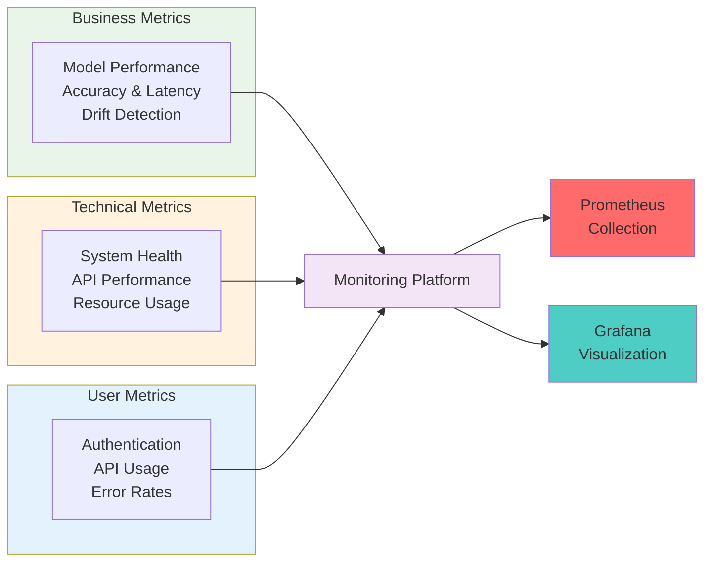

<div style="display: flex; justify-content: center;">
  <h1> 🧠 Epilepsy Prediction MLOps Platform </h1>
</div>

[](https://python.org)
[](https://fastapi.tiangolo.com)
[](https://docker.com)
[](https://mlflow.org)
[](https://prometheus.io)
[](https://grafana.com)

*Une plateforme MLOps complète pour la prédiction d'épilepsie avec orchestration automatisée*

[🚀 Démarrage Rapide](#-démarrage-rapide) • [📋 Documentation](#-documentation) • [🏗️ Architecture](#️-architecture) • [🤝 Contribution](#-contribution)

</div>

---

## 🎯 Vue d'ensemble

Cette plateforme MLOps de pointe offre une solution complète pour la prédiction d'épilepsie, intégrant les meilleures pratiques DevOps et MLOps dans un environnement de microservices hautement scalable et sécurisé.

Le schéma suivant illustre le workflow général, étant donné qu'un utilisateur lance une requete pour faire une prédiction : 


### ✨ Fonctionnalités Clés

```mermaid
graph LR
    A[🔐 Authentification JWT] --> B[📊 Preprocessing]
    B --> C[🤖 Training LSTM]
    C --> D[📈 Evaluation]
    D --> E[🚀 Inference API]
    E --> F[📱 Monitoring]
    
    style A fill:#e1f5fe
    style B fill:#f3e5f5
    style C fill:#e8f5e8
    style D fill:#fff3e0
    style E fill:#fce4ec
    style F fill:#f1f8e9
```


## 🗂️ Structure du Projet

```
📁 epilepsy-mlops/
├── 🔧 .github/workflows/          # CI/CD Pipeline
│   └── ci-cd.yml
├── 📊 monitoring/                 # Prometheus & Grafana configs
│   ├── prometheus/
│   └── grafana/
├── 🐳 services/                   # Microservices
│   ├── 🔐 authentication/        # JWT Auth API
│   ├── 📊 preprocessing/          # Data Pipeline
│   ├── 🤖 model_training/         # LSTM Training
│   ├── 📈 evaluation/             # Model Evaluation
│   ├── 🚀 inference/              # Prediction API
│   └── 📋 patient_data_pull/      # Data Extraction
├── 🧪 tests/                      # Test Suite
│   ├── unit/
├── 📦 data/                       # Data Management
│   ├── raw/
│   ├── processed/
│   └── models/
├── ⚡ orchestration/              # Prefect Workflows
│   └── flows/
├── 🐳 docker-compose.yml          # Container Orchestration
├── 📋 requirements.txt            # Dependencies
└── 📚 docs/                       # Documentation
```
## 🏗️ Architecture Système

### Infrastructure MLOps

Le schéma suivant détaille le workflow MLOPS utilisé : 


### Pipeline de Données

```mermaid
flowchart TD
    A[📥 Raw Patient Data] --> B{🔍 Data Validation}
    B -->|✅ Valid| C[🧹 Preprocessing]
    B -->|❌ Invalid| D[⚠️ Error Handling]
    
    C --> E[⚖️ Balanced Sampling]
    E --> F[🔢 LSTM Format Conversion]
    F --> G[💾 Processed Data Storage]
    
    G --> H[🤖 Model Training]
    H --> I[📊 Model Evaluation]
    I --> J{📈 Performance Check}
    
    
    J -->|⭐ Better| K[🚀 Model Promotion]
    J -->|📉 Worse| L[🔄 Retrain with New Params]
    
    K --> M[🌐 Production Deployment]
    M --> N[📱 Real-time Inference]
    
    style A fill:#e3f2fd
    style C fill:#f3e5f5
    style H fill:#e8f5e8
    style I fill:#fff3e0
    style K fill:#e8f5e8
    style M fill:#fce4ec
    style N fill:#f1f8e9
```



## 🚀 Démarrage Rapide

### Prérequis

```bash
# Versions requises
Python >= 3.10
Docker >= 20.10
Docker Compose >= 2.0
Git >= 2.30
```

### Installation Express

```bash
# 1️⃣ Cloner le repository
git clone https://github.com/your-org/epilepsy-mlops.git
cd epilepsy-mlops

# 2️⃣ Configuration de l'environnement
python -m venv virtmlops

virtmlops\Scripts\activate (windows)

# 3️⃣ Batir les images
docker-compose build

# 4️⃣ Initialiser les données
dvc pull

# 5️⃣ Démarrer l'infrastructure
docker-compose up -d
```

### Accès aux Services

| Service | URL | Description |
|---------|-----|-------------|
| 🔐 Authentication | `http://localhost:8000` | API d'authentification JWT |
| 🚀 Inference API | `http://localhost:8001` | Prédictions en temps réel |
| 🔬 MLflow UI | `http://localhost:5000` | Suivi des expériences |
| 📊 Prometheus | `http://localhost:9090` | Métriques système |
| 📈 Grafana | `http://localhost:3000` | Dashboards de monitoring |
| ⚡ Prefect UI | `http://localhost:4200` | Orchestration des workflows |

## 🔄 Pipeline CI/CD

### GitHub Actions Workflow

```mermaid
graph LR
    A[📝 Code Push/PR] --> B[🧪 Unit Tests]
    B --> C{✅ Tests Pass?}
    C -->|❌ Fail| D[🚫 Block Pipeline]
    C -->|✅ Pass| E[🏗️ Build Docker Images]
    E --> F[📦 Push to Docker Hub]
    F --> G[🎉 Deployment Ready]
    
    subgraph "🐳 Services Built"
        S1[Authentication]
        S2[Preprocessing] 
        S3[Model Training]
        S4[Evaluation]
        S5[Inference]
        S6[Patient Data Pull]
        S7[Prefect Orchestrator]
    end
    
    E -.-> S1
    E -.-> S2
    E -.-> S3
    E -.-> S4
    E -.-> S5
    E -.-> S6
    E -.-> S7
    
    style A fill:#e3f2fd
    style B fill:#f3e5f5
    style C fill:#fff3e0
    style E fill:#e8f5e8
    style F fill:#f1f8e9
    style G fill:#e8eaf6
    style D fill:#ffebee
```



## 📊 Monitoring & Observabilité

## 🤝 Contribution

1. **Fork** le repository
2. **Créer** une branche feature (`git checkout -b feature/amazing-feature`)
3. **Commiter** vos changements (`git commit -m '✨ Add amazing feature'`)
4. **Pousser** vers la branche (`git push origin feature/amazing-feature`)
5. **Ouvrir** une Pull Request


---

<div align="center">

**🌟 Si ce projet vous aide, n'hésitez pas à lui donner une étoile ! 🌟**

[⬆️ Retour en haut](#-epilepsy-prediction-mlops-platform)

</div>

---

<div align="center">
<sub>Machine Learning Operations • © 2025</sub>

  
</div>


